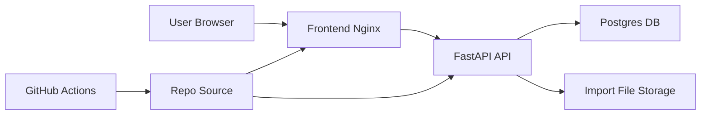

## Executive summary
The current architecture is suitable for local development, but publishing it online as-is would create immediate high-risk exposure: unauthenticated read/write access to all financial data, no tenant boundaries, and unbounded upload paths. The highest-risk areas are API authentication/authorization design, import upload/storage controls, and identity/ownership modeling before introducing user/admin flows.

## Scope and assumptions
- In-scope paths:
  - `backend/app/`
  - `frontend/src/services/`
  - `frontend/nginx.conf`
  - `docker-compose.yml`
  - `.github/workflows/`
- Out-of-scope:
  - UI component visual behavior not tied to data security
  - local machine hardening and host OS controls
  - third-party cloud account setup details not present in repo
- Explicit assumptions:
  - Current state: not internet-exposed; used locally.
  - Planned state: deploy Dockerized service to Render with public frontend/API reachability.
  - User/admin flows and auth are planned but not implemented yet.
  - Current data is personal financial data (high sensitivity for confidentiality and integrity).
  - Single database schema will initially back all users unless reworked.
- Open questions that materially change ranking:
  - Will backend API be publicly reachable directly, or only via frontend origin/proxy restrictions?
  - Will auth be session-cookie or token-based (changes CSRF and token theft risks)?
  - Is per-user encryption/auditability a launch requirement?

## System model
### Primary components
- Browser SPA (React/Vite) calling backend JSON and multipart endpoints via `fetch`:
  - evidence: `frontend/src/services/api.ts`, `frontend/src/services/imports.ts`, `frontend/src/main.tsx`
- Frontend container (Nginx) serving static assets and proxying `/api/` to backend:
  - evidence: `frontend/nginx.conf`, `frontend/Dockerfile`
- FastAPI backend with multiple unauthenticated routers:
  - evidence: `backend/app/main.py`, `backend/app/routers/*.py`
- PostgreSQL storing canonical transactions, imports, raw rows, splits, analytics metadata:
  - evidence: `backend/app/models/*.py`
- File storage for uploaded CSV imports:
  - evidence: `backend/app/services/import_service.py` (`_store_import_file`)
- CI/automation workflows for build checks and upstream component sync:
  - evidence: `.github/workflows/sanity.yml`, `.github/workflows/sync-components.yml`

### Data flows and trust boundaries
- Internet/User browser -> Frontend Nginx
  - Data crossing: page requests, static assets.
  - Channel: HTTP/HTTPS.
  - Security guarantees: TLS depends on deployment edge; no app-level auth in frontend.
  - Validation: standard static file serving and SPA fallback (`try_files`).
  - Evidence: `frontend/nginx.conf`.
- Browser SPA -> Backend API (via `/api` proxy or direct base URL)
  - Data crossing: transaction/payee/category CRUD payloads, analytics queries, import CSV uploads.
  - Channel: HTTP JSON + multipart form data.
  - Security guarantees: CORS middleware only; no authn/authz or rate limiting found.
  - Validation: Pydantic models and route-level checks for select fields; no identity checks.
  - Evidence: `backend/app/main.py`, `backend/app/routers/transactions.py`, `backend/app/routers/imports.py`.
- Backend API -> Postgres
  - Data crossing: raw import rows (`raw_json`), account numbers, transaction/split state, analytics aggregates.
  - Channel: SQLAlchemy over DB connection string.
  - Security guarantees: DB credentials from env, no row-level tenant constraints in models.
  - Validation: ORM constraints (uniques, FKs) plus service invariants (split sum).
  - Evidence: `backend/app/db.py`, `backend/app/models/import_models.py`, `backend/app/models/transaction.py`, `backend/app/services/ledger_validation.py`.
- Backend API -> Local/volume file storage
  - Data crossing: uploaded CSV bytes and later file download.
  - Channel: filesystem path under configured import storage dir.
  - Security guarantees: filename sanitization and resolved-path parent check on download.
  - Validation: basename sanitization and traversal guard.
  - Evidence: `backend/app/services/import_service.py` (`_safe_filename`, `_store_import_file`), `backend/app/routers/imports.py` (`download_import_file`).
- CI workflow runner -> external GitHub repo sync path (dev/build boundary, non-runtime)
  - Data crossing: source files from upstream repo into this repo, automated commit/PR.
  - Channel: git clone over HTTPS in workflow.
  - Security guarantees: manual `workflow_dispatch`, but broad write permissions when run.
  - Validation: file filtering for demo/story files; no integrity pinning.
  - Evidence: `.github/workflows/sync-components.yml`.

#### Diagram

## Assets and security objectives
| Asset | Why it matters | Security objective (C/I/A) |
|---|---|---|
| Raw bank import rows (`raw_json`) | Contains full banking export details and potentially sensitive descriptors | C, I |
| Canonical transactions and splits | Drives budgeting and analytics decisions; integrity-critical financial history | I, A |
| Account identifiers (`account_num`) | Sensitive financial metadata; can enable correlation or misuse | C |
| Import CSV files on disk | Recoverable copies of raw bank data | C, A |
| API mutation surfaces (PATCH/PUT/POST/DELETE) | Can rewrite or destroy financial state | I, A |
| DB credentials/env config | Compromise allows direct data access and tampering | C, I |
| Build/sync pipeline output | Compromised pipeline can ship malicious frontend/backend code | I |
| Auditability/change history | Needed to investigate abuse or accidental corruption | I, A |

## Attacker model
### Capabilities
- Remote unauthenticated internet attacker once deployed publicly.
- Ability to script direct API requests (not limited to frontend UI).
- Ability to send large or malformed CSV uploads.
- Ability to enumerate integer IDs and invoke read/mutation endpoints.
- Opportunistic attacker leveraging misconfiguration (default creds, permissive exposure).

### Non-capabilities
- No assumed host-level access to Render/container runtime by default.
- No assumed compromise of Postgres internals without credential/network weakness.
- No assumed maintainer compromise (unless analyzing CI supply-chain threat scenario).

## Entry points and attack surfaces
| Surface | How reached | Trust boundary | Notes | Evidence (repo path / symbol) |
|---|---|---|---|---|
| `POST /imports/preview` | Browser multipart upload | Browser -> API | Reads full file into memory, parses CSV preview | `backend/app/routers/imports.py` `preview_import` |
| `POST /imports` | Browser multipart upload | Browser -> API | Persists file + rows + links transactions | `backend/app/routers/imports.py` `create_import`, `backend/app/services/import_service.py` |
| `GET /imports/*` including `/file` | Browser/API caller | Browser -> API | Exposes import metadata, raw row content, downloadable CSV | `backend/app/routers/imports.py` |
| `GET/PATCH/PUT /transactions*` | Browser/API caller | Browser -> API | Ledger reads + state-changing operations (type/comment/splits) | `backend/app/routers/transactions.py` |
| `CRUD /categories /payees /internal-accounts` | Browser/API caller | Browser -> API | Data model mutation without identity ownership checks | `backend/app/routers/categories.py`, `backend/app/routers/payees.py`, `backend/app/routers/internal_accounts.py` |
| `GET /analytics/*` | Browser/API caller | Browser -> API | Aggregated financial analytics by payee/internal-account/category | `backend/app/routers/analytics.py` |
| Nginx `/api/` proxy | Browser HTTP request | Browser -> Frontend proxy | Forwards requests to backend; security depends on deployment edge config | `frontend/nginx.conf` |
| GitHub `sync-components` workflow | Manual workflow_dispatch | CI runner -> repo | Pulls external code and opens PR with write perms | `.github/workflows/sync-components.yml` |

## Top abuse paths
1. Goal: exfiltrate personal financial history.
   1. Attacker discovers public API endpoint.
   2. Calls `GET /imports`, `GET /imports/rows`, `GET /transactions`, `GET /analytics/*`.
   3. Enumerates IDs (`/imports/{id}`, `/imports/{id}/rows/{row_id}`) and extracts raw data.
   4. Impact: bulk confidentiality breach.
2. Goal: silently corrupt ledger integrity.
   1. Attacker calls `PATCH /transactions/{id}` to alter type/comment.
   2. Calls `PUT /transactions/{id}/splits` with crafted split sets that still pass sum checks.
   3. Alters analytics outputs and user decisions.
   4. Impact: integrity compromise without provenance trail.
3. Goal: service degradation and cost amplification.
   1. Attacker repeatedly uploads large CSVs to `/imports/preview` and `/imports`.
   2. Backend reads full file in memory and performs parse/DB writes.
   3. Disk and DB storage grow via `import_rows`/stored CSV files.
   4. Impact: memory pressure, storage exhaustion, degraded availability.
4. Goal: broaden access once multi-user launches.
   1. Attacker authenticates as low-privilege user (future state).
   2. Enumerates sequential IDs in transaction/import/category routes.
   3. Accesses or mutates other users’ objects due to missing owner scoping.
   4. Impact: cross-account data breach and tampering.
5. Goal: exploit future cookie-auth rollout.
   1. App adds cookies for auth but keeps current broad method surfaces.
   2. Victim visits malicious site that issues forged state-changing requests.
   3. Backend accepts request absent CSRF protections.
   4. Impact: unauthorized mutations under victim context.
6. Goal: recover sensitive source data from storage.
   1. Attacker gets app-level or backup-level access to stored imports.
   2. Reads persisted raw CSV and `raw_json` rows.
   3. Reconstructs account-level spending and personal metadata.
   4. Impact: durable confidentiality breach.
7. Goal: introduce malicious code through supply chain.
   1. Maintainer triggers sync workflow.
   2. Workflow pulls external repository content and commits changes.
   3. Malicious upstream changes get merged with insufficient review.
   4. Impact: shipped code integrity compromise.

## Threat model table
| Threat ID | Threat source | Prerequisites | Threat action | Impact | Impacted assets | Existing controls (evidence) | Gaps | Recommended mitigations | Detection ideas | Likelihood | Impact severity | Priority |
|---|---|---|---|---|---|---|---|---|---|---|---|---|
| TM-001 | Remote internet attacker | Service is deployed publicly before authn/authz is implemented. | Calls read and mutation endpoints directly to extract and alter financial data. | Full confidentiality and integrity compromise of financial records. | Raw imports, transactions, splits, analytics outputs. | Basic CORS config only (`backend/app/main.py`); route-level payload validation (`backend/app/routers/*.py`). | No authentication, no authorization, no ownership scoping. | Add mandatory auth before internet launch (OIDC/session or token), enforce per-resource ownership checks, deny anonymous access by default. | Structured access logs per route/status/IP, anomaly alerts for high-volume list/read/mutate patterns. | High (on public deployment) | High | critical |
| TM-002 | Remote attacker or abusive client | API reachable; upload endpoints enabled. | Sends oversized/repeated CSV uploads to preview/create endpoints to consume memory, CPU, storage. | Availability degradation and infrastructure cost growth. | API availability, DB/storage capacity. | CSV parse errors handled; upload emptiness checks (`backend/app/routers/imports.py`). | `await file.read()` loads full body; no explicit size/rate limits; persistent raw file storage. | Enforce request size limits (Nginx/FastAPI), per-IP/user rate limits, streaming parse, storage quotas/retention for imports. | Metrics on request size, import frequency, queue latency, disk growth alarms. | High (if public) | Medium | high |
| TM-003 | Remote attacker with API access | Public API and predictable object IDs; no access control. | Enumerates import/row/transaction IDs and reads sensitive raw data, including downloadable import files. | Large-scale financial data disclosure. | `raw_json`, CSV files, account metadata. | File path traversal guard and filename sanitization (`backend/app/routers/imports.py`, `backend/app/services/import_service.py`). | No identity checks on read endpoints; sensitive raw data retained indefinitely. | Require auth + owner scoping on all reads, minimize exposed raw fields, implement retention and optional encryption-at-rest for stored import files. | Alert on sequential ID access patterns and abnormal row/file download activity. | High (on public deployment) | High | critical |
| TM-004 | Authenticated user attacker (future multi-user) | User/admin model introduced without tenant-safe schema and policy layer. | Accesses/modifies other users’ data via IDOR across shared tables. | Cross-tenant breach and unauthorized data changes. | All user-linked financial records. | Data integrity constraints (FK/unique) in models (`backend/app/models/*.py`). | No `user_id` ownership model today, no policy engine or row-level authorization. | Introduce tenant/user ownership columns + indexes, enforce query scoping in all routers, add authorization tests for every endpoint. | Security regression tests for IDOR, audit logs with actor/resource IDs. | Medium (near-future launch risk) | High | high |
| TM-005 | Web attacker targeting authenticated victim (future cookie auth) | Cookie-based auth introduced; CORS/CSRF posture unchanged. | Triggers forged state-changing requests from attacker-controlled origin. | Unauthorized mutations under victim session. | Transactions, splits, payees/categories/internal accounts. | CORS middleware exists (`backend/app/main.py`). | No CSRF defenses or origin-bound mutation policy implemented. | If using cookies: CSRF token + SameSite + origin checks. If token auth: avoid ambient cookies for API and enforce Authorization header. | Log/alert on failed CSRF/origin checks; monitor unusual mutation bursts per user/session. | Medium | High | high |
| TM-006 | Insider/compromised client | Write access to mutation endpoints. | Makes destructive but valid ledger edits lacking robust traceability. | Financial history integrity loss and poor incident recoverability. | Transactions/splits integrity, auditability. | Split invariant enforcement (`backend/app/services/ledger_validation.py`). | No immutable audit trail for who changed what/when; replace-all split semantics can erase context. | Add append-only audit log/events, version critical records, support reversible change history and admin diff views. | Emit audit events for PATCH/PUT/DELETE and alert on high-risk mutation sequences. | Medium | Medium | medium |
| TM-007 | Supply-chain adversary via upstream dependency | Maintainer triggers sync workflow and merges changes with weak review. | Injects malicious code from external repository sync path. | Shipped frontend integrity compromise (possible credential/data theft in browser). | Frontend code integrity, user trust. | Manual workflow dispatch + PR flow (`.github/workflows/sync-components.yml`). | External repo not pinned to vetted commit allowlist/signature policy; broad workflow write permissions. | Pin sync source to reviewed commit/tag, require CODEOWNERS security review for sync PRs, constrain workflow permissions where possible. | Alert on unusual large sync diffs and sensitive file changes in sync PRs. | Medium | Medium | medium |
| TM-008 | Misconfiguration attacker | Production deployment reuses weak/default secrets/network posture. | Exploits predictable DB creds or overexposed DB/API networking. | Unauthorized DB access and data tampering/exfiltration. | DB data, service integrity. | Env-based config plumbing exists (`backend/app/config.py`, `docker-compose.yml`). | Development defaults (`postgres/postgres`) are unsafe if reused; no secret-rotation policy in repo. | Enforce managed secrets in Render, rotate credentials, private DB networking, startup checks that reject weak/default prod creds. | Startup security checks + alerts on auth failures and unusual DB connection sources. | Medium | High | high |

## Criticality calibration
- Critical:
  - Unauthenticated public access to full financial read/write API (`TM-001`, `TM-003`).
  - Cross-tenant access once user model exists but ownership checks are incomplete.
  - Any exploit yielding bulk raw banking data exfiltration.
- High:
  - Internet-reachable upload abuse that materially degrades service (`TM-002`).
  - CSRF or equivalent session-riding after auth rollout (`TM-005`).
  - Production secret/network misconfiguration exposing DB/API (`TM-008`).
- Medium:
  - Integrity abuse with limited blast radius due to missing audit/versioning (`TM-006`).
  - CI sync supply-chain risk requiring maintainer action (`TM-007`).
  - Partial data leakage where attacker needs additional internal foothold.
- Low:
  - Issues requiring unrealistic preconditions (host compromise first).
  - Non-sensitive metadata leaks with minimal user harm.
  - Noisy attacks already blocked by deployment controls and quotas.

## Focus paths for security review
| Path | Why it matters | Related Threat IDs |
|---|---|---|
| `backend/app/main.py` | Global middleware posture (CORS now, future auth/CSRF integration point). | TM-001, TM-005 |
| `backend/app/routers/imports.py` | Highest-risk upload and sensitive-data retrieval endpoints. | TM-002, TM-003 |
| `backend/app/services/import_service.py` | CSV parsing, file persistence, dedupe pipeline, and memory/storage behavior. | TM-002, TM-003 |
| `backend/app/routers/transactions.py` | Core mutable financial state endpoints. | TM-001, TM-004, TM-006 |
| `backend/app/routers/categories.py` | Unauthenticated data mutation and deletion semantics. | TM-001, TM-006 |
| `backend/app/routers/payees.py` | Unauthenticated data mutation and canonical name behavior. | TM-001, TM-006 |
| `backend/app/routers/internal_accounts.py` | Unauthenticated mutation with resequencing and archival toggles. | TM-001, TM-006 |
| `backend/app/routers/analytics.py` | High-value read endpoints for financial aggregation exfiltration. | TM-001, TM-003 |
| `backend/app/models/import_models.py` | Sensitive raw data persistence and linkage structure. | TM-003, TM-004 |
| `backend/app/models/transaction.py` | Integrity-critical canonical transaction state. | TM-004, TM-006 |
| `frontend/src/services/api.ts` | Client request behavior; future auth header/session strategy choke point. | TM-001, TM-005 |
| `frontend/src/services/imports.ts` | Upload behavior and direct fetch calls that bypass shared wrappers. | TM-002 |
| `frontend/nginx.conf` | Proxy boundary and request/size control enforcement location. | TM-002, TM-008 |
| `docker-compose.yml` | Environment defaults and credential patterns likely copied to deployment. | TM-008 |
| `.github/workflows/sync-components.yml` | External code ingestion and automation trust boundary. | TM-007 |

Coverage checklist:
- All discovered runtime entry points are represented in the entry-point table.
- Each trust boundary above is represented by at least one threat.
- Runtime behavior is separated from CI/dev risks (`TM-007` scoped to workflow).
- User clarification (currently local, planned Render publication, auth later) is reflected in assumptions and rankings.
- Assumptions and open questions that change priority are explicit.
